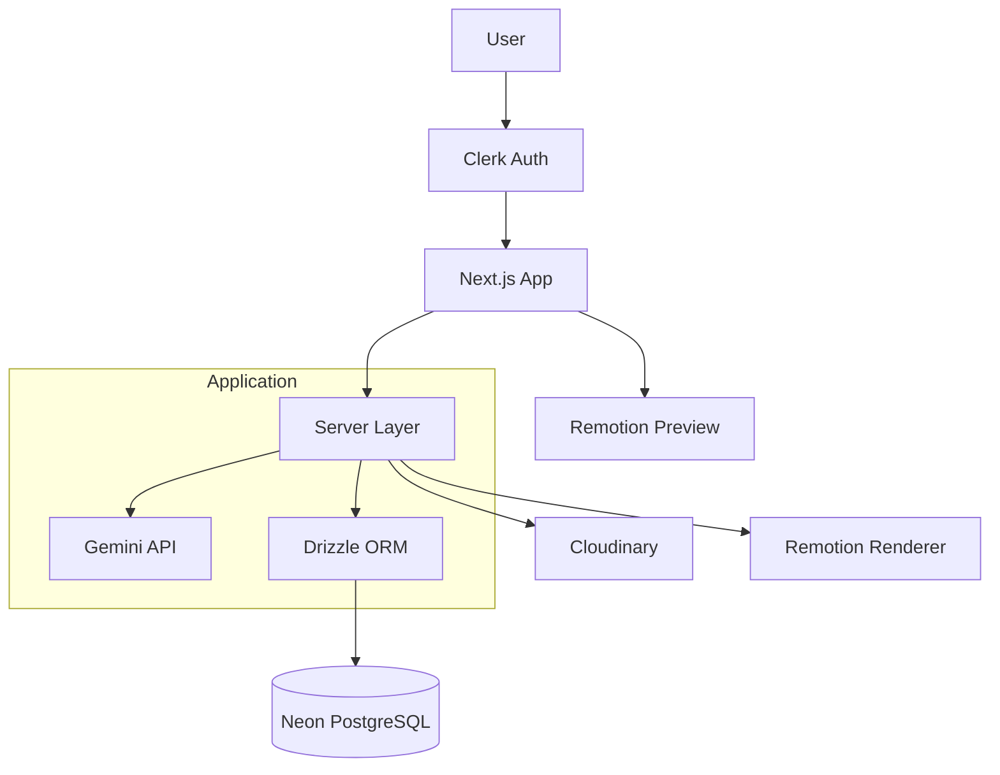

# 🎬 AI Short Video Generator

<div align="center">

[](https://nextjs.org/)
[](https://www.typescriptlang.org/)
[](https://tailwindcss.com/)
[](https://clerk.com/)
[](https://neon.tech/)
[](https://orm.drizzle.team/)
[](https://www.remotion.dev/)
[](https://cloudinary.com/)
[](https://ai.google.dev/)
[](https://www.assemblyai.com/)
[](https://huggingface.co/)
[](https://opensource.org/licenses/MIT)

**Hệ thống tạo video ngắn tự động bằng AI – từ kịch bản đến preview hoàn chỉnh**
<br />
🌐 [Xem Demo](https://ai-video-generator-yw3i.onrender.com/) - 🐞 [Báo Lỗi](https://github.com/SonCryptoz/ai-video-generator/issues)

</div>

## 📖 Giới thiệu

**AI Short Video Generator** là một ứng dụng web fullstack cho phép người dùng tạo video ngắn tự động bằng AI.  

Hệ thống có thể:

- Sinh kịch bản video
- Tạo hình ảnh theo prompt
- Kết hợp audio và phụ đề
- Preview video trực tiếp trên web bằng Remotion
- Quản lý video cá nhân trong Dashboard

Dự án tập trung vào:
- 🔐 Bảo mật server-side với Clerk
- 🧱 Kiến trúc tách biệt rõ ràng Client – Server
- 🗄 Database chuẩn hóa với Drizzle ORM
- 🎬 Tích hợp video engine vào ứng dụng web thực tế

---

## ✨ Tính năng chính

- 🔐 **Authentication & Authorization:** Xác thực người dùng bằng Clerk
- 🎬 **Video Preview Engine:** Render video bằng Remotion
- 🧠 **AI Script Generation:** Tạo nội dung video tự động
- 🖼 **AI Image Prompt:** Sinh hình ảnh theo ngữ cảnh kịch bản
- 🎙 **Audio + Captions Support**
- 📂 **Dashboard quản lý video cá nhân**
- 🔍 **Search nội dung trong video**
- 🎨 **Giao diện đa dạng:** Hỗ trợ thay đổi nhiều Theme (Retro, Dark, Cyberpunk) nhờ DaisyUI.
- ↕ **Sort theo ID (ASC / DESC)**
- 🗑 **Delete có kiểm tra quyền sở hữu**
- 📄 **Client-side Pagination**

---

## 🧠 Kiến trúc hệ thống


---

## 🔒 Nguyên tắc bảo mật

- Không tin dữ liệu định danh từ client
- Mọi thao tác CRUD đều kiểm tra auth().userId
- Chỉ chủ sở hữu mới có quyền xoá video
- API được bảo vệ hoàn toàn ở server
---

## 🛠 Công nghệ sử dụng

### 🚀 Frontend
- **Next.js 16 (App Router)**
- **React 19**
- **TypeScript**
- **Tailwind CSS 4 + DaisyUI**
- **Framer Motion + GSAP** (Animation nâng cao)
- **Radix UI** (Accessible Components)
- **Zustand** (State Management)

### 🎬 Video Engine
- **Remotion** (Render video bằng React)
- **Remotion Bundler / Renderer**

### 🤖 AI & Media Processing
- **Google Gemini API** (Script / Content Generation)
- **Hugging Face Inference API** (AI Model Integration)
- **AssemblyAI** (Speech-to-Text / Voice Processing)

### ☁️ Backend & Database
- **Next.js API Routes**
- **Drizzle ORM**
- **Neon PostgreSQL (Serverless DB)**
- **Clerk Authentication**
- **Cloudinary** (Media Storage & CDN)

### 🧰 Dev Tools
- **Drizzle Kit**
- **ESLint**
- **TypeScript 5**
---

## 🚀 Cài đặt

### Clone Project

```bash
git clone https://github.com/SonCryptoz/ai-video-generator.git
cd ai-video-generator
```

### Cài dependencies

```bash
npm i
```

### Tạo file môi trường .env.local

```bash
NEXT_PUBLIC_DRIZZLE_DATABASE_URL=your_url

NEXT_PUBLIC_CLERK_PUBLISHABLE_KEY=your_key
CLERK_SECRET_KEY=your_key

NEXT_PUBLIC_CLERK_SIGN_IN_URL=/sign-in
NEXT_PUBLIC_CLERK_SIGN_UP_URL=/sign-up

NEXT_PUBLIC_CLERK_SIGN_IN_FALLBACK_REDIRECT_URL=/
NEXT_PUBLIC_CLERK_SIGN_UP_FALLBACK_REDIRECT_URL=/

NEXT_PUBLIC_GEMINI_API_KEY=your_key

MURF_API_KEY=your_key

CLOUDINARY_CLOUD_NAME=your_cloud_name
CLOUDINARY_API_KEY=your_cloudinary_api_key
CLOUDINARY_API_SECRET=your_cloudinary_api_secret

CAPTION_API=your_caption_api

HF_TOKEN=your_hf_token

NEXT_PUBLIC_APP_URL=your_app_url
```

### Thiết lập Database (Drizzle)
```bash
npm run db:push
npm run db:studio
```

### Chế độ Development

```bash
npm run dev
```  

### Truy cập

```bash
http://localhost:3000
```
---

## ⚠️ Hạn chế (Free Tier)

Ứng dụng hiện được triển khai trên hạ tầng miễn phí (Render Free Tier – 0.1 CPU, 512MB RAM).
Do giới hạn tài nguyên, hệ thống có thể gặp một số vấn đề sau:
- Có thể xảy ra cold start
- Preview video có thể chậm khi tải lần đầu
- Tính năng render video bị hạn chế do không đủ RAM và CPU (Free Tier)
- Thời lượng video tạo ra có thể không dài do các API generate (script, audio, image) đang sử dụng bản miễn phí (free / trial), nên bị giới hạn số token.

Mục đích triển khai trên Free Tier là để demo và phục vụ mục tiêu học tập.

---

## 📁 Cấu trúc thư mục

```txt
/app
    /_context        # Global Context Provider (Auth, Theme, App State)
    /(auth)          # Route nhóm cho đăng nhập / đăng ký (Clerk)
    /action          # Server Actions (AI generation, DB mutation)
    /api             # API Routes (upload, render, AI handler)
    /dashboard       # Trang quản lý video & user workspace
    /store           # Zustand store (timeline, scene, video state)
    globals.css
    layout.tsx
    logo.svg
    page.tsx
    provider.tsx
    theme-provider.tsx

/components
    /ui              # Reusable UI components (button, dialog, slider...)

/configs            # Cấu hình AI model, DB, cloud services
/lib                # Helper functions, utils, API clients
/public             # Static assets (fonts, icons, images)
/remotion           # Video composition, scenes, templates
/scripts            # Script xử render video
```
---

## 🎯 Mục tiêu học tập

- [x] **AI Video Pipeline:** Xây dựng hoàn chỉnh quy trình Prompt → Script → Audio → Scene → Render cho hệ thống tạo video tự động.
- [x] **AI Integration:** Tích hợp Gemini API để sinh nội dung kịch bản, tối ưu Prompt Engineering và chuẩn hóa output cho video engine.
- [x] **Video Rendering Engine:** Làm chủ cơ chế dựng video bằng Remotion, thiết kế composition động bằng React.
- [x] **Authentication & SaaS Architecture:** Triển khai xác thực người dùng với Clerk và xây dựng hệ thống đa người dùng.
- [x] **Database & ORM:** Thiết kế schema và quản lý dữ liệu bằng Drizzle ORM kết hợp PostgreSQL serverless.
- [x] **Modern Fullstack:** Thành thạo Next.js 16+ (App Router) và quản lý state với Zustand.
- [x] **Media & Cloud Handling:** Xử lý upload, lưu trữ và phân phối media qua Cloudinary, tối ưu hiệu suất render và streaming.
---

## 🧭 Hướng phát triển

💾 **Lưu lịch sử render video:** Cho phép mỗi user xem lại toàn bộ video đã tạo, chỉnh sửa lại project và đồng bộ giữa nhiều thiết bị.

💳 **Tích hợp hệ thống Credit AI / Subscription:** Giới hạn số lần render theo gói (Free / Pro), quản lý credit theo thời lượng video hoặc độ phức tạp render.

🌍 **Hỗ trợ đa ngôn ngữ:** Cho phép tạo video bằng nhiều ngôn ngữ khác nhau, tự động dịch script và generate voice tương ứng.

🔗 **Tạo link share public:** Xuất video thành link public (CDN) hoặc embed vào website, hỗ trợ preview nhanh và download MP4.

⚙️ **Background job queue để render video thực:** Tách quá trình render nặng khỏi request chính bằng job queue (Redis / Worker), xử lý song song và tránh timeout server.

---

## 🙏 Lời cảm ơn

Dự án này sẽ không thể hoàn thiện nếu thiếu sự hỗ trợ từ các công cụ và nền tảng sau:

- **Google Gemini API** – Cung cấp khả năng sinh nội dung kịch bản và xử lý ngôn ngữ tự nhiên cho hệ thống AI.
- **Remotion** – Nền tảng dựng video bằng React, giúp hiện thực hóa ý tưởng tạo video động từ dữ liệu.
- **Clerk** – Hệ thống xác thực và quản lý người dùng cho mô hình SaaS.
- **Neon** – Cung cấp PostgreSQL serverless cho việc lưu trữ dữ liệu.
- **Drizzle ORM** – Công cụ quản lý schema và truy vấn database theo hướng type-safe.
- **Cloudinary** – Lưu trữ và phân phối media thông qua CDN.
- **Next.js & Tailwind CSS** – Nền tảng xây dựng giao diện web hiện đại và hiệu năng cao.  
- **Zustand & Framer Motion & GSAP** – Quản lý state và animation giúp trải nghiệm người dùng mượt mà hơn.

Ngoài ra, xin gửi lời cảm ơn đến cộng đồng **Open Source** và các tác giả blog, tutorial về:

- **AI Video Generation**  
- **React-based Rendering**  
- **Serverless Architecture**
- **Prompt Engineering**
- **SaaS Application Design**

Những tài liệu và ví dụ thực tế từ cộng đồng đã góp phần quan trọng trong việc xây dựng và hoàn thiện dự án này. ❤️
