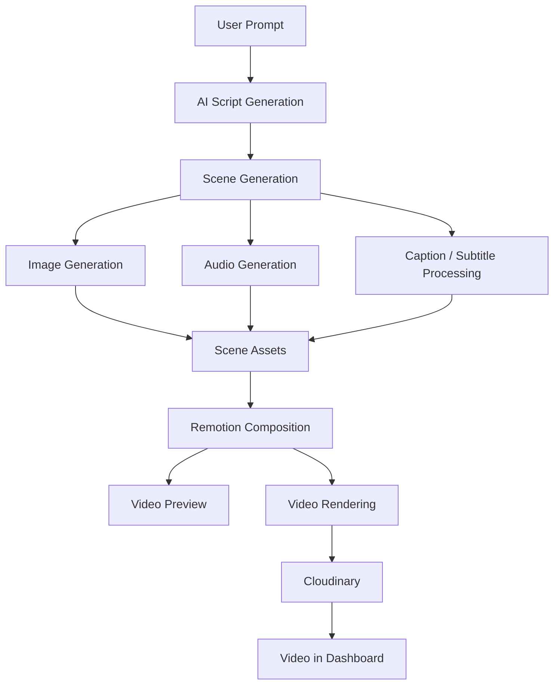
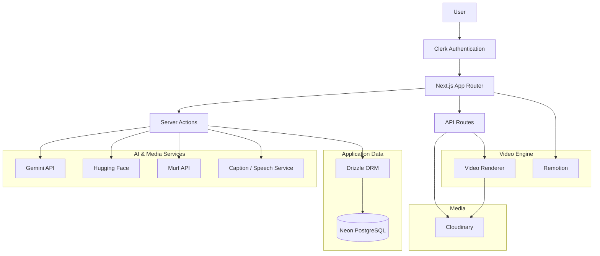

# AI Short Video Generator

<div align="center">

[](https://nextjs.org/)
[](https://www.typescriptlang.org/)
[](https://tailwindcss.com/)
[](https://clerk.com/)
[](https://neon.tech/)
[](https://orm.drizzle.team/)
[](https://www.remotion.dev/)
[](https://cloudinary.com/)
[](https://ai.google.dev/)
[](https://www.assemblyai.com/)
[](https://huggingface.co/)
[](https://opensource.org/licenses/MIT)

**Ứng dụng web fullstack hỗ trợ tạo video ngắn bằng AI**
<br />
[Xem Demo](https://ai-video-generator-yw3i.onrender.com/) - [Báo Lỗi](https://github.com/SonCryptoz/ai-video-generator/issues)

</div>

## Giới thiệu

**AI Short Video Generator** là ứng dụng web fullstack cho phép người dùng tạo video ngắn từ nội dung được sinh tự động bằng AI.

Ứng dụng xây dựng một pipeline gồm nhiều bước: **tạo nội dung → tạo script → xử lý audio → tạo scene → dựng video**, sau đó sử dụng **Remotion** để preview và render video trực tiếp trong ứng dụng.

Hệ thống sử dụng **Next.js 16 App Router** cho frontend và server-side logic, **Clerk** cho authentication, **Drizzle ORM + Neon PostgreSQL** cho dữ liệu ứng dụng và **Cloudinary** cho media storage.

Dự án tập trung vào việc tích hợp các dịch vụ AI và media processing vào một ứng dụng web fullstack thay vì chỉ thực hiện riêng lẻ từng bước tạo nội dung.

## Tính năng

### Video Generation

* Tạo nội dung và script video bằng AI.
* Tạo hình ảnh dựa trên nội dung và prompt của từng scene.
* Kết hợp hình ảnh, audio và captions.
* Tạo composition video động bằng React và Remotion.
* Preview video trực tiếp trên trình duyệt.
* Render video từ các composition đã tạo.

### Dashboard

* Quản lý các video đã tạo.
* Tìm kiếm video theo nội dung.
* Sắp xếp danh sách video theo ID tăng dần hoặc giảm dần.
* Phân trang dữ liệu phía client.
* Xóa video và kiểm tra quyền sở hữu trước khi thực hiện mutation.

### Authentication

* Đăng ký và đăng nhập thông qua Clerk.
* Quản lý user identity ở server-side.
* Bảo vệ các thao tác liên quan đến dữ liệu người dùng.
* Kiểm tra ownership trước các thao tác CRUD.

## Video Generation Pipeline

Quy trình tạo video có thể được mô tả như sau:


```mermaid
graph TD

    A[User Prompt] --> B[AI Script Generation]
    B --> C[Scene Generation]

    C --> D[Image Generation]
    C --> E[Audio Generation]
    C --> F[Caption / Subtitle Processing]

    D --> G[Scene Assets]
    E --> G
    F --> G

    G --> H[Remotion Composition]
    H --> I[Video Preview]
    H --> J[Video Rendering]

    J --> K[Cloudinary]
    K --> L[Video in Dashboard]
```

### Pipeline

1. Người dùng nhập prompt hoặc nội dung muốn tạo video.
2. Gemini được sử dụng để tạo và chuẩn hóa script.
3. Script được chia thành các scene.
4. Mỗi scene được xử lý để tạo image, audio và caption tương ứng.
5. Các assets được đưa vào Remotion composition.
6. Remotion tạo preview và xử lý quá trình render.
7. Video output được lưu trữ và quản lý thông qua Cloudinary.
8. Người dùng có thể xem lại các video đã tạo trong Dashboard.

## Kiến trúc hệ thống


```mermaid
graph TD

    A[User] --> B[Clerk Authentication]
    B --> C[Next.js App Router]

    C --> D[Server Actions]
    C --> E[API Routes]

    subgraph AI["AI & Media Services"]
        F[Gemini API]
        G[Hugging Face]
        H[Murf API]
        I[Caption / Speech Service]
    end

    subgraph Data["Application Data"]
        J[Drizzle ORM]
        K[(Neon PostgreSQL)]
    end

    subgraph Media["Media"]
        L[Cloudinary]
    end

    subgraph Video["Video Engine"]
        M[Remotion]
        N[Video Renderer]
    end

    D --> F
    D --> G
    D --> H
    D --> I

    D --> J
    J --> K

    E --> L

    C --> M
    E --> N
    N --> L
```

## Bảo mật

Các thao tác liên quan đến dữ liệu người dùng được xử lý ở server-side.

* Không tin tưởng `userId` được gửi trực tiếp từ client.
* User identity được lấy từ Clerk ở server.
* Các mutation kiểm tra `auth().userId` trước khi thực hiện.
* Chỉ chủ sở hữu mới có thể xóa dữ liệu video tương ứng.
* Các secret API key được lưu trong environment variables.
* Không expose các server-side credentials ra client.

## Công nghệ

### Frontend

* **Next.js 16 / App Router** – Framework chính cho ứng dụng.
* **React 19** – Xây dựng UI và Remotion compositions.
* **TypeScript** – Static typing.
* **Tailwind CSS 4 + DaisyUI** – Styling và theme.
* **Framer Motion + GSAP** – Animation và UI transitions.
* **Radix UI** – Accessible UI primitives.
* **Zustand** – Global state management.

### Video

* **Remotion** – Tạo video composition bằng React.
* **Remotion Bundler / Renderer** – Bundle và render video.

### AI & Media

* **Google Gemini API** – Sinh script và nội dung video.
* **Hugging Face Inference API** – Tích hợp AI models.
* **Murf API** – Text-to-Speech / voice generation.
* **AssemblyAI / Caption API** – Speech-to-text và caption processing.
* **Cloudinary** – Media storage và CDN.

### Backend & Database

* **Next.js Server Actions / API Routes** – Server-side operations.
* **Drizzle ORM** – Database ORM.
* **Neon PostgreSQL** – Serverless PostgreSQL database.
* **Clerk** – Authentication và user management.

### Development

* **Drizzle Kit** – Database schema và migrations.
* **ESLint** – Code quality.
* **TypeScript** – Type checking.

## Cài đặt

### 1. Clone repository

```bash
git clone https://github.com/SonCryptoz/ai-video-generator.git
cd ai-video-generator
```

### 2. Cài dependencies

```bash
npm install
```

### 3. Cấu hình environment variables

Tạo file `.env.local`:

```env
NEXT_PUBLIC_DRIZZLE_DATABASE_URL=your_database_url

NEXT_PUBLIC_CLERK_PUBLISHABLE_KEY=your_clerk_publishable_key
CLERK_SECRET_KEY=your_clerk_secret_key

NEXT_PUBLIC_CLERK_SIGN_IN_URL=/sign-in
NEXT_PUBLIC_CLERK_SIGN_UP_URL=/sign-up

NEXT_PUBLIC_CLERK_SIGN_IN_FALLBACK_REDIRECT_URL=/
NEXT_PUBLIC_CLERK_SIGN_UP_FALLBACK_REDIRECT_URL=/

NEXT_PUBLIC_GEMINI_API_KEY=your_gemini_key

MURF_API_KEY=your_murf_key

CLOUDINARY_CLOUD_NAME=your_cloud_name
CLOUDINARY_API_KEY=your_cloudinary_api_key
CLOUDINARY_API_SECRET=your_cloudinary_api_secret

CAPTION_API=your_assembly_caption_api

HF_TOKEN=your_huggingface_token

NEXT_PUBLIC_APP_URL=http://localhost:3000
```

Các secret key không nên được commit vào repository.

### 4. Thiết lập database

Đẩy schema lên database:

```bash
npm run db:push
```

Mở Drizzle Studio:

```bash
npm run db:studio
```

### 5. Chạy development server

```bash
npm run dev
```

Truy cập:

```text
http://localhost:3000
```

## Cấu trúc thư mục

```text
ai-video-generator/
│
├── app/
│   ├── _context/               # Global providers và application context
│   ├── (auth)/                 # Authentication routes
│   ├── action/                 # Server Actions
│   ├── api/                    # API Routes
│   ├── dashboard/              # Video dashboard
│   ├── store/                  # Client state
│   ├── globals.css
│   ├── layout.tsx
│   ├── logo.svg
│   ├── page.tsx
│   ├── provider.tsx
│   └── theme-provider.tsx
│
├── components/
│   └── ui/                     # Reusable UI components
│
├── configs/                    # AI, database và service configuration
├── lib/                        # Helpers, utilities và API clients
├── public/                     # Static assets
├── remotion/                   # Video compositions, scenes và templates
├── scripts/                    # Video rendering scripts
│
├── drizzle.config.ts
├── package.json
├── next.config.ts
└── README.md
```

## Những gì đã học được

Thông qua dự án này, tôi có cơ hội thực hành:

* Xây dựng ứng dụng fullstack với Next.js App Router.
* Tích hợp nhiều AI services vào một workflow thống nhất.
* Thiết kế pipeline từ prompt đến script, audio, scene và video output.
* Xây dựng video composition động bằng React và Remotion.
* Xử lý video rendering trong môi trường web.
* Triển khai authentication và authorization với Clerk.
* Thiết kế database schema và thao tác dữ liệu bằng Drizzle ORM.
* Sử dụng PostgreSQL serverless với Neon.
* Quản lý media storage và CDN thông qua Cloudinary.
* Quản lý client state bằng Zustand.
* Tách server-side operations khỏi client-side UI.
* Kiểm tra ownership và bảo vệ các thao tác CRUD.

## Hạn chế khi triển khai

Phiên bản demo hiện được triển khai trên **Render Free Tier**, vì vậy tài nguyên CPU và RAM bị giới hạn.

Một số hạn chế có thể gặp:

* Cold start khiến thời gian phản hồi ban đầu tăng.
* Video preview có thể tải chậm trong lần đầu.
* Video rendering bị giới hạn bởi CPU và RAM của môi trường deployment.
* Các API AI ở free/trial tier có giới hạn về request, token hoặc thời gian xử lý.
* Video dài hoặc pipeline có nhiều scene có thể mất nhiều thời gian để hoàn thành.
* Các tác vụ render nặng không phù hợp để xử lý trực tiếp trong request lifecycle của một server tài nguyên thấp.

Phiên bản hiện tại chủ yếu phục vụ **demo và mục đích học tập**, chưa được thiết kế cho workload production có yêu cầu render lớn.

## Hướng phát triển

### Video Rendering Queue

Tách quá trình render khỏi request chính bằng background job queue và worker.

Có thể sử dụng:

* Redis + BullMQ
* Dedicated rendering worker
* Serverless job queue

Mục tiêu là tránh timeout khi render video dài hoặc nhiều scene.

### Credit & Subscription

Xây dựng hệ thống credit để giới hạn tài nguyên theo từng tài khoản:

* Free
* Pro
* Premium

Credit có thể được tính dựa trên thời lượng video, số scene hoặc chi phí AI API.

### Project Management

Mở rộng Dashboard thành workspace hoàn chỉnh:

* Lưu lịch sử render.
* Chỉnh sửa project đã tạo.
* Duplicate project.
* Đồng bộ project giữa nhiều thiết bị.
* Quản lý version của video.

### Public Video Sharing

Cho phép người dùng:

* Tạo public URL cho video.
* Embed video vào website.
* Preview thông qua CDN.
* Download video output.

### Multi-language Video

Mở rộng pipeline để hỗ trợ:

* Nhiều ngôn ngữ cho script.
* Translation tự động.
* Voice generation theo ngôn ngữ.
* Caption tương ứng với từng ngôn ngữ.

## Lời cảm ơn

Dự án này sẽ không thể hoàn thiện nếu thiếu sự hỗ trợ từ các công cụ và nền tảng sau:

- **Google Gemini API** – Cung cấp khả năng sinh nội dung kịch bản và xử lý ngôn ngữ tự nhiên cho hệ thống AI.
- **Remotion** – Nền tảng dựng video bằng React, giúp hiện thực hóa ý tưởng tạo video động từ dữ liệu.
- **Clerk** – Hệ thống xác thực và quản lý người dùng cho mô hình SaaS.
- **Neon** – Cung cấp PostgreSQL serverless cho việc lưu trữ dữ liệu.
- **Drizzle ORM** – Công cụ quản lý schema và truy vấn database theo hướng type-safe.
- **Cloudinary** – Lưu trữ và phân phối media thông qua CDN.
- **Next.js & Tailwind CSS** – Nền tảng xây dựng giao diện web hiện đại và hiệu năng cao.  
- **Zustand & Framer Motion & GSAP** – Quản lý state và animation giúp trải nghiệm người dùng mượt mà hơn.

Ngoài ra, xin gửi lời cảm ơn đến cộng đồng **Open Source** và các tác giả blog, tutorial về:

- **AI Video Generation**  
- **React-based Rendering**  
- **Serverless Architecture**
- **Prompt Engineering**
- **SaaS Application Design**

Những tài liệu và ví dụ thực tế từ cộng đồng đã góp phần quan trọng trong việc xây dựng và hoàn thiện dự án này. ❤️
